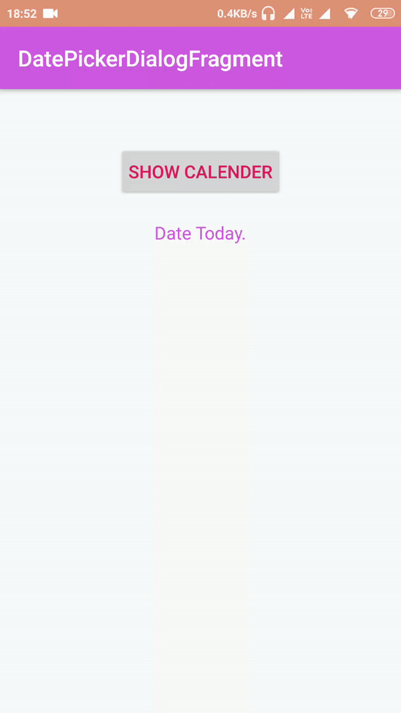

# DatePickerDialogFragment
 This a datepicker Dialog .
This project is created by Rahul Kushwaha .  On 22March2019.This project is already created by Saagi in Kotlin. But I am  implementing using Java.**/

you can see this documentations for full informations  https://android-arsenal.com/details/1/6577 

Steps:-
1) In manifest file add permission for Internet.

2)Check  if  support and design library is present in build.gradle(Module:app)

A Gif image is shown below:-

